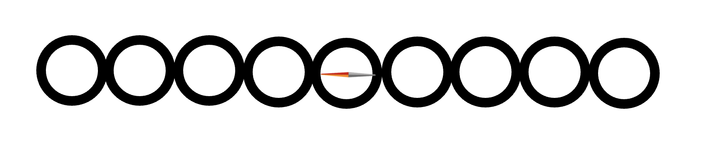
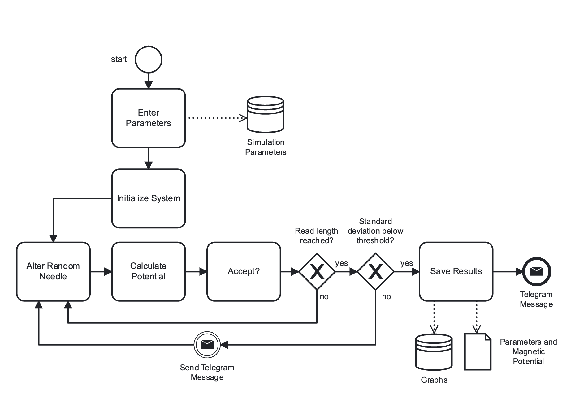
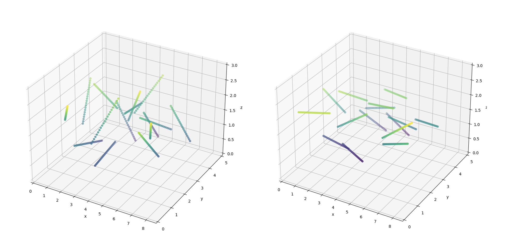

# MN_Simulator

## Structure

### Needle
One needle consists of spheres. The middle sphere also contains a dipole, which calculates the dipole-dipole potential.
A needle always consists of an odd number of spheres, so there is always one middle sphere.

     
    <em>Figure 1: Representation of one needle.</em>

### Needles 
All needles are saved in one array. 

### Boundaries of the Simulation
The simulation is handled inside a cuboid. The needles are not allowed to touch or protrude outside the boundaries. 

### Program Flow
Below is the general flow of the program using a BPMN (which, of course, is not the program you should actually use for something like that :D)
First, all needles are initialized inside the cuboid. After that, in each step, the angle of one random needle is altered randomly.
The following step checks whether the position is allowed (all spheres are inside the cuboid and do not overlap).
Then, the total energy (all potentials together) is calculated, and if it is lower than before, the new state is accepted. 

     
    <em>Figure 2: The flow of the program.</em>

In the beginning, the size of the convergence interval is fixed. The size is the number of steps until convergence is checked again.
Convergence is checked on the interval between now and the last check. For this, the following metric is used:

$$m = \frac{sd}{mean}$$

Where $sd$ is the standard deviation of the interval.

## Potentials

### Hard-Sphere Potential 
This potential is implemented to guarantee that the Spheres do not overlap. 
It is actually not realized as a potential but just a function that checks for overlaps. 
The formula to check the overlap is shown below. Where $\overrightarrow{a}$ is the position of the first sphere and $\overrightarrow{b}$ is the position of the second and 
$d$ is the diameter of the sphere (two times the radius).

$${|\overrightarrow{a}-\overrightarrow{b}|}_2 > d$$

Because every sphere needs to be checked against every other sphere of every other needle, this has a time complexity of about $\mathcal{O}(\frac{N^{2}}{2})$.

### Dipole-Dipole Potential 
The Dipole-Dipole Potential is calculated with the following potential. 
Where $c$ is a prefactor ($\frac{\mu }{4\pi}$), $\overrightarrow{m_{1}}$ and  $\overrightarrow{m_{2}}$ are the charges of the dipoles and $r$ the distance between the dipoles. 

$$u_{dd}=c*(\frac{\overrightarrow{m_{1}}\cdot\overrightarrow{m_{2}}}{r^{3}}-\frac{(\overrightarrow{m_{1}}\cdot\overrightarrow{r})(\overrightarrow{m_{2}}\cdot\overrightarrow{r})}{r^{5}})$$

Gain every middle sphere must be compared against every other middle sphere so the time complexity is again $\mathcal{O}(\frac{N^{2}}{2})$.

### Field Potential 
The field potential for every needle is calculated with a simple dot product, as shown below 
where $\overrightarrow{m_{1}}$ is the charge of the dipole and $\overrightarrow{f}$ the vector of the field.

$$u_{f} = \overrightarrow{m_{1}} \cdot \overrightarrow{f}$$

## Results 
As one can see in Figure 3 and Figure 4, the needles align according to the field vector  $(2000, 0, 0)^{T}$.

     
    <em>
    Figure 3: The system after the initialization (left) and the system after the simulation (right).
    </em>

